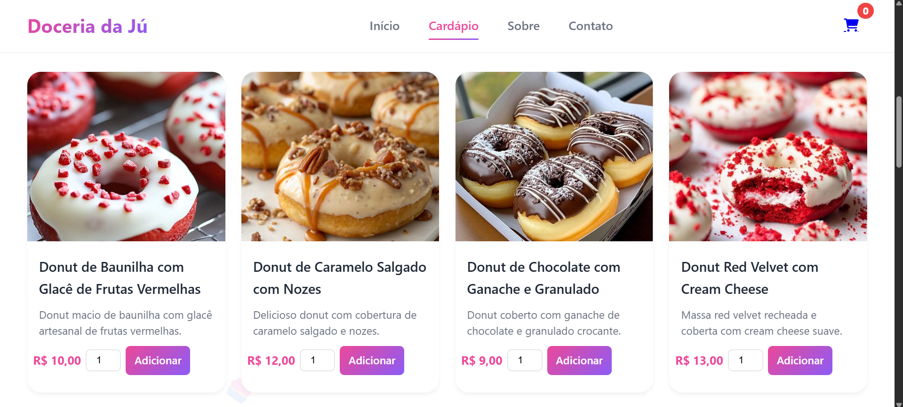
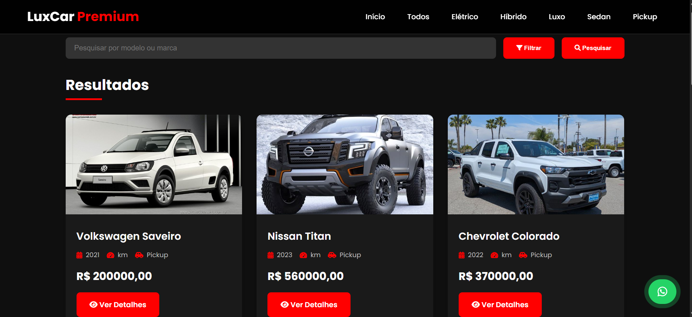

# 🧑🏻‍💻 Arthur Cavalcanti

**`Desenvolvedor Back-end`**

---

## 👨‍💻 Sobre Mim

Olá! Sou **Arthur Cavalcanti**, tenho 18 anos e sou estudante de **Engenharia de Software**.  
Apaixonado por tecnologia, atuo como desenvolvedor **back-end**, com foco em **Python** e frameworks como **Django** e **Flask**. Tenho experiência com **bancos de dados relacionais** (PostgreSQL, MySQL, SQLite) utilizando **SQLAlchemy** e também com **bancos NoSQL**, como **MongoDB**, aplicando boas práticas de modelagem e consultas otimizadas. Meus projetos já está acessível para o público, tudo isso reflete meu compromisso com aprendizado contínuo e evolução profissional.  

    

---

## 🚀 Projetos em Destaque

### 🍰 Doceria da Jú
<table align="center" style="margin: 0 auto; width: 80%; border: 1px solid #333; border-radius: 5px; background-color: #1a1a1a;">
  <tr>
    <td style="text-align: center; vertical-align: middle; width: 40%;">
      
    </td>
    <td style="text-align: left; padding-left: 20px; vertical-align: middle; width: 60%;">
Site institucional desenvolvido com <b>Django</b> e <b>MySQL</b>, integrado a ferramentas Python para gerenciamento de produtos, pedidos e informações institucionais. Conta com design moderno, navegação intuitiva e vitrine digital para cardápio, história da marca e canais de contato.
       
      🔗 <a href="https://doceriadaju.techimperium.com.br/pagina_inicial/">Acessar projeto</a>
    </td>
  </tr>
</table>

### 🚘 LuxCar Premium
<table align="center" style="margin: 0 auto; width: 80%; border: 1px solid #333; border-radius: 5px; background-color: #1a1a1a;">
  <tr>
    <td style="text-align: center; vertical-align: middle; width: 40%;">
      
    </td>
    <td style="text-align: left; padding-left: 20px; vertical-align: middle; width: 60%;">
Plataforma institucional para exposição de veículos premium, desenvolvida com <b>Django</b>, <b>MySQL</b> e ferramentas Python. Inclui exibição dinâmica por categorias (elétrico, híbrido, luxo, sedan, pickup), simulação de financiamento, promoções e integração com WhatsApp.
       
      🔗 <a href="https://luxcarpremium.techimperium.com.br/">Acessar projeto</a>
    </td>
  </tr>
</table>
---

## 🛠️ Linguagens e Tecnologias

  
  
  
  
  
  
  

---

## 📊 Estatísticas

  
  

---

## 📫 Entre em Contato

  <button onclick="window.location.href='https://wa.me/5581987229685'" style="background-color: #25D366; color: white; border: none; padding: 10px 20px; margin: 5px; border-radius: 5px; cursor: pointer;">
     WhatsApp
  </button>
  <button onclick="window.location.href='https://instagram.com/arthur_felipe_a.c/'" style="background-color: #E4405F; color: white; border: none; padding: 10px 20px; margin: 5px; border-radius: 5px; cursor: pointer;">
     Instagram
  </button>
  <button onclick="window.location.href='mailto:antunescavalcantiarthurfelipe@gmail.com'" style="background-color: #D14836; color: white; border: none; padding: 10px 20px; margin: 5px; border-radius: 5px; cursor: pointer;">
     Gmail
  </button>

